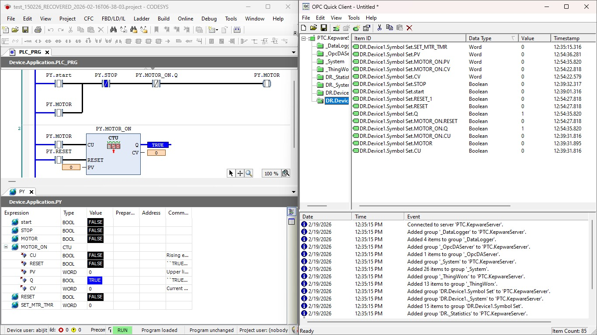
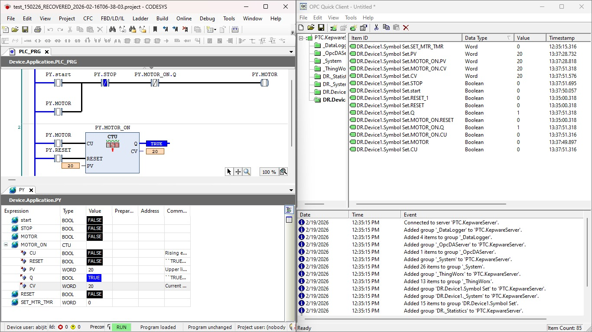
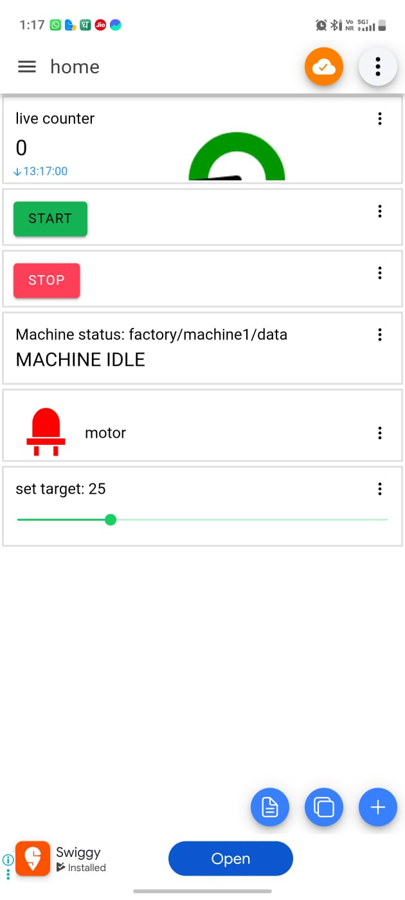
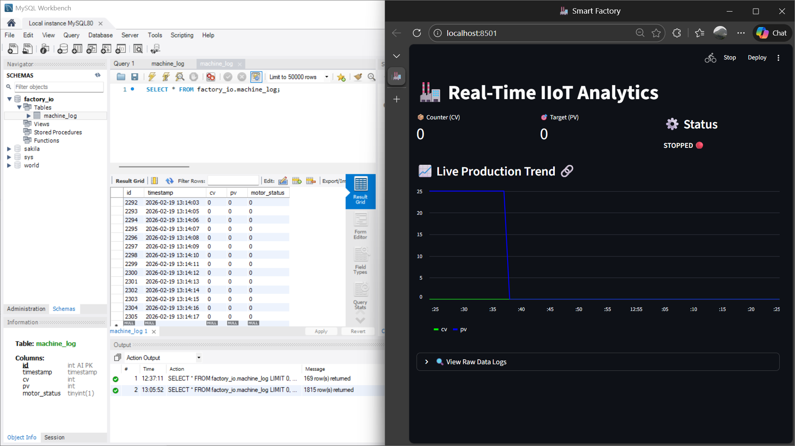
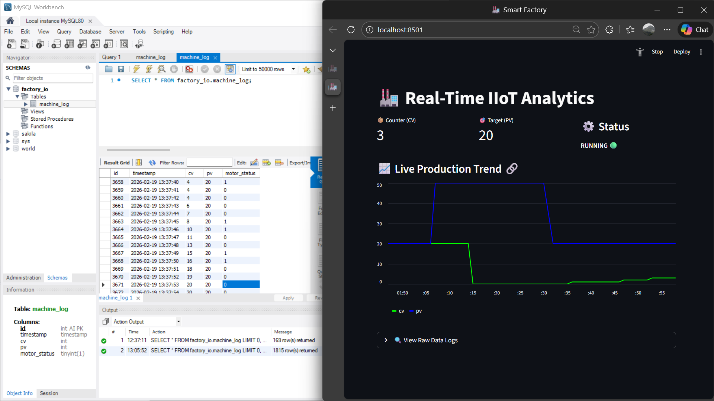
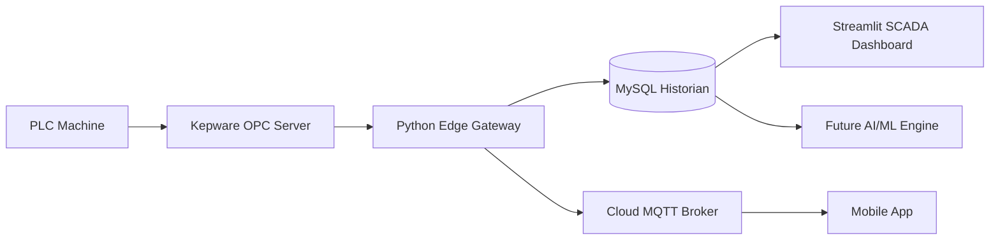

# 🏭 Enterprise Industrial IoT Gateway  
### PLC → Edge → SQL → Cloud → Analytics



---

# 📌 Executive Summary
This project demonstrates a **production-grade Industry 4.0 architecture** that bridges OT (factory floor) and IT (cloud & analytics).

A Python-based edge gateway collects real-time machine data from a PLC via OPC UA, logs it into an enterprise SQL historian, and publishes it to the cloud via MQTT for mobile monitoring and remote control.

The system mirrors real smart-factory infrastructure used in modern manufacturing environments.

---

# 🎯 Key Capabilities
- Real-time PLC data acquisition (OPC UA)
- Edge gateway architecture (Python)
- SQL historian logging (MySQL)
- Cloud telemetry (MQTT TLS)
- Mobile monitoring & control
- SCADA-style analytics dashboard
- AI/ML-ready production dataset

---

# 🖼️ System Preview

## PLC + Kepware Layer


## Mobile MQTT Monitoring


## MySQL Historian


## Live Analytics Dashboard


---

# 🏗️ Full System Architecture


## 🌐 Network Architecture (Industrial IIoT Topology)

This architecture follows a standard ISA-95 layered industrial model separating control, supervisory, IT, and cloud layers.

```mermaid
flowchart TD

subgraph L0["Level 0-1 • Machine & Control Layer"]
PLC[PLC / CODESYS Runtime]
IO[Sensors & Actuators]
PLC --- IO
end

subgraph L2["Level 2 • Supervisory / Edge Layer"]
Kepware[Kepware OPC UA Server]
Edge[Python Edge Gateway<br>OPC UA + MQTT + SQL]
MySQL[(MySQL Historian)]
end

subgraph L3["Level 3 • Plant IT Layer"]
Dashboard[Streamlit SCADA Dashboard]
LocalUsers[Plant Engineers / Managers]
end

subgraph L4["Level 4-5 • Cloud & Remote"]
MQTT[HiveMQ Cloud Broker<br>TLS 8883]
Mobile[Mobile MQTT App]
AI[Future AI/Analytics Server]
end

PLC -->|Industrial Ethernet| Kepware
Kepware -->|OPC UA| Edge
Edge -->|SQL TCP/IP| MySQL
MySQL --> Dashboard
Dashboard --> LocalUsers

Edge -->|MQTT TLS| MQTT
MQTT --> Mobile
MySQL --> AI
